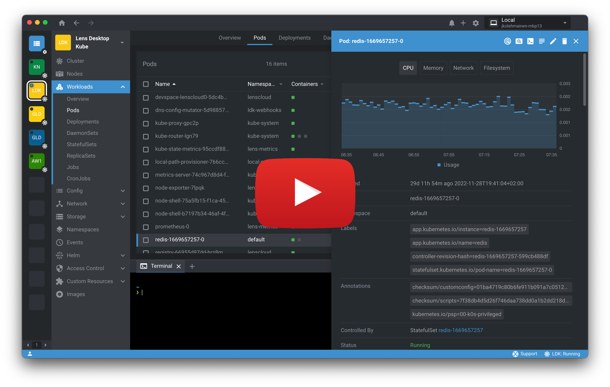

# Lens | Open Source

## The Repository

This repository ("OpenLens") is where we (Team Lens) develop the Lens product together with the community.
## Lens - The Kubernetes IDE

Lens provides the full situational awareness for everything that runs in Kubernetes. It's lowering the barrier of entry for people just getting started and radically improving productivity for people with more experience.

The Lens open source project ("OpenLens") is backed by a number of Kubernetes and cloud native ecosystem pioneers. It's a standalone application for MacOS, Windows and Linux operating systems. OpenLens is 100% open source and free of charge for any purpose.

## What makes Lens special?

* Amazing usability and end-user experience
* Unified, secure, multi-cluster management on any platform: support for hundreds of clusters
* Standalone application: no need to install anything in-cluster
* Lens installs anywhere, elimanting the need to wrangle credentials
* Real-time cluster state visualization
* Resource utilization charts and trends with history powered by built-in Prometheus
* Smart terminal access to nodes and containers
* Clusters can be local (e.g. minikube) or external (e.g. EKS, GKE, AKS)
* Performance optimized to handle massive clusters (tested with a cluster running 25k pods)
* RBAC security is preserved, as Lens uses the standard Kubernetes API
* Lens Extensions are used to add custom visualizations and functionality to accelerate development workflows for all the technologies and services that integrate with Kubernetes
* Port forwarding
* Helm package deployment: Browse and deploy Helm charts with one click-Install
* Extensions via Lens Extensions API

## Installation

See [Getting Started](https://docs.k8slens.dev/latest/getting-started/) page.

## Development

See [Development](https://docs.k8slens.dev/latest/contributing/development/) page.

## Contributing

See [Contributing](https://docs.k8slens.dev/latest/contributing/) page.
